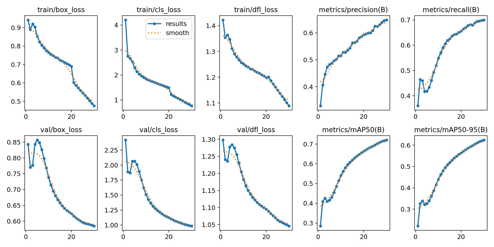
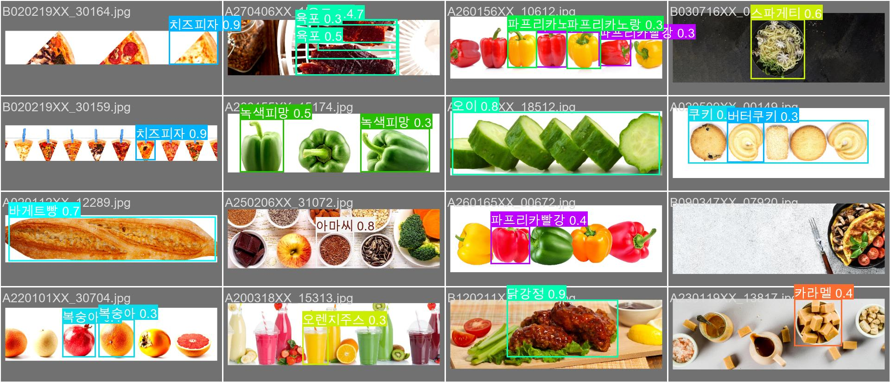
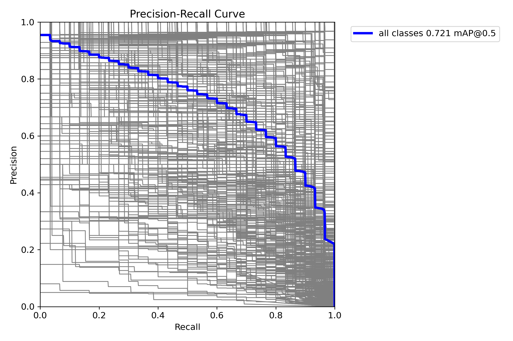

# 🥗 AllerCheck — 개인 맞춤형 식품 알레르기 관리 시스템

**사진 한 장으로 알레르기 위험을 판단하는 AI 웹 서비스**입니다. YOLO v8로 음식 이미지를 인식하고, 신뢰도가 낮으면 Gemini 2.5 Flash로 보완하는 **하이브리드 추론 구조**를 통해, 인식된 음식을 DB의 알레르기 정보·사용자 개인 알레르기와 실시간 대조해 "위험/안심"을 알려줍니다.

> [1학기 데이터베이스 프로젝트](https://github.com/cajsf/Food_Allergy_Detect_Project)(콘솔 기반 알레르기 정보 시스템)를 기반으로, 딥러닝·LLM·웹 서비스를 결합해 확장한 후속 프로젝트입니다. — 2025-2 파이썬기반딥러닝 기말 프로젝트 (개인)

## 시스템 구성

```
사용자 (웹 UI: HTML + Tailwind CSS)
   │  이미지 업로드 / 텍스트 검색          ← JWT 인증
   ▼
FastAPI 백엔드
   │
   ├─ ① YOLO v8 Small 추론 (571개 음식 클래스)
   │     └─ confidence < 0.7 → ② Gemini 2.5 Flash 보완 추론
   ├─ ③ MySQL 대조: 식품·성분·교차반응군 × 사용자 알레르기
   │     └─ "위험/안심" 뱃지 + 대체식품·주의사항 반환
   └─ ④ 오인식 피드백 → 이미지·정답 라벨 자동 축적 (재학습용)
```

## 주요 기능

- **이미지 기반 검색** — 음식 사진 업로드만으로 음식명 인식 → 관련 제품·알레르기 정보 자동 검색
- **하이브리드 추론** — YOLO confidence가 0.7 미만이면 Gemini에 2차 분석을 요청해 시각적으로 유사한 음식(탕/찌개류 등)의 오인식을 보완
- **개인 맞춤 위험 판단** — 등록한 알레르기·교차반응군 데이터와 실시간 대조해 검색 결과에 위험 경고 표시
- **성분표 자동 분석 (관리자)** — 성분표 사진을 Gemini OCR로 읽어 알레르기 유발 물질을 자동 추출·매핑, 제품 등록 폼에 자동 체크
- **피드백 기반 데이터 수집 (MLOps)** — 사용자가 오인식을 신고하면 이미지가 `static/dataset/`으로 이동하고 정답 라벨이 `feedback_log.csv`에 기록되어, 향후 Hard Sample 재학습 데이터로 축적
- **인증·보안** — OAuth2 + JWT 토큰 인증, bcrypt 해싱, 사용자/관리자 역할 분리
- **관리자 대시보드** — 제품 CRUD, 알레르기 TOP 5 통계, 전체 사용자 조회

## AI 모델

**데이터셋** — AI Hub [건강관리를 위한 음식 이미지](https://aihub.or.kr/aihubdata/data/view.do?dataSetSn=242) (571개 클래스, 약 300만 장)

- 전체 데이터를 그대로 쓰기엔 로컬 GPU 환경에서 불가능 → **클래스당 300장 균등 샘플링**으로 약 17만 장 재구성 (클래스 불균형 최소화)
- JSON annotation → YOLO 포맷 변환, 640×640 리사이징 ([`데이터 전처리.py`](데이터%20전처리.py))

**학습** — YOLO v8 Small, COCO 사전학습 가중치 기반 전이학습 (RTX 4070, 30 epochs + Early Stopping)

- 데이터 증강: HSV 변형, ±10° 회전, 좌우 반전, Mosaic (상하 반전은 "음식이 쏟아지므로" 0으로 설정)

**성능 (Validation 기준)**

| Precision | Recall | mAP50 | mAP50-95 | Best F1 |
|:---:|:---:|:---:|:---:|:---:|
| 0.648 | 0.700 | **0.721** | 0.624 | 0.66 @ conf 0.242 |

<p align="center">
  
</p>
<p align="center">
  
  
</p>

## 기술적 도전과 해결

| 문제 | 해결 |
|---|---|
| 100 epoch 학습 시 1 epoch당 약 40분 → 수십 시간 소요 | 30 epoch + Early Stopping(patience=5)으로 조정, 과적합 없이 수렴 확인 |
| batch=32에서 GPU 메모리 부족(OOM)으로 학습 중단 반복 | batch=16으로 축소해 30 epoch 완주. 오히려 32일 때 예상 학습 시간이 더 길게 나오는 현상도 관찰 (메모리 한계 사용에 따른 속도 저하로 추정) |
| DataLoader workers=8에서 시스템 RAM 부족으로 프로세스 강제 종료 | workers=4로 하향 조정해 안정화 — GPU뿐 아니라 RAM도 학습 병목임을 확인 |
| 형태·색이 유사한 음식(탕류·찌개류·튀김류) 간 오인식 | confidence 기반 Gemini 2차 분석 하이브리드 전략으로 완화 |
| 크롤링한 외부 이미지 URL 직접 호출 시 핫링크 차단·외부 서버 종속 문제 | 전 제품 이미지를 로컬로 다운로드 후 **WebP(품질 80%)로 일괄 변환** — 용량 30~50% 절감, FastAPI StaticFiles로 서빙 |

## 기술 스택

| 구분 | 기술 |
|---|---|
| AI | YOLO v8 Small (Ultralytics), Google Gemini 2.5 Flash API, PyTorch |
| Backend | FastAPI (async), Pydantic, Uvicorn |
| DB | MySQL (3NF, 10개 테이블 — [DB 프로젝트](https://github.com/cajsf/Food_Allergy_Detect_Project)에서 확장) |
| 인증 | OAuth2 + JWT, bcrypt |
| Frontend | HTML5, Tailwind CSS, Fetch API |
| 이미지 처리 | Pillow, OpenCV, WebP 최적화 |
| 배포 | Docker (nvidia/cuda 기반 GPU 컨테이너) |

## 프로젝트 구조

```
├── api_main.py               # FastAPI 서버 (AI 추론·인증·API 전체)
├── queries.py                # MySQL 쿼리 계층
├── index/search/mypage/admin.html + script.js + style.css   # 프론트엔드
├── weights/best.pt           # 학습된 YOLO 모델 가중치
├── train.py                  # YOLO 학습 스크립트
├── validate_model.py         # 검증 및 Confusion Matrix 생성
├── predict.py                # 단일 이미지 추론 테스트
├── 데이터 전처리.py             # AI Hub → YOLO 포맷 변환·샘플링
├── download_images.py        # 제품 이미지 로컬화 + WebP 변환
├── 웹크롤링_오뚜기.ipynb        # 제품·성분 데이터 크롤링
├── 데이터베이스.ipynb           # DB·테이블 생성 및 데이터 적재
├── Food_Detection_Project/   # 학습·검증 결과 (곡선, Confusion Matrix 등)
├── SQL/                      # 초기 데이터
└── dockerfile                # GPU 지원 배포 이미지
```

## 실행 방법

**요구 환경**: Python 3.10+, MySQL 8.0+, NVIDIA GPU + CUDA, Docker Desktop(GPU 지원), NVIDIA Container Toolkit

1. `.env.example`을 `.env`로 복사하고 `SECRET_KEY`(JWT용 임의 문자열)와 `GOOGLE_API_KEY`(Gemini API 키)를 채웁니다. (`.env`는 git에 올라가지 않습니다)
2. `데이터베이스.ipynb`를 실행해 DB·테이블 생성 및 데이터를 적재합니다.
3. Docker 이미지 빌드 및 실행:

```powershell
docker build -t allercheck-gpu .

docker run --rm -it --gpus all -p 8000:8000 `
  --env-file .env `
  -v "<프로젝트 경로>\static\profiles:/app/static/profiles" `
  -v "<프로젝트 경로>\static\ai_temp:/app/static/ai_temp" `
  -v "<프로젝트 경로>\static\dataset:/app/static/dataset" `
  --name allercheck-gpu-container allercheck-gpu
```

4. `http://localhost:8000` 접속 → 회원가입 후 사용. 관리자 기능은 `admin` 계정 가입 후 노트북의 관리자 설정 코드 실행.

> 볼륨 마운트는 프로필 이미지·AI 임시 파일·피드백 데이터가 컨테이너 재시작 후에도 유지되도록 하기 위한 설정입니다. Docker 없이 로컬 실행도 가능합니다: `pip install -r requirements.txt` 후 `uvicorn api_main:app` (`.env`는 자동 로드됩니다)

## 문서

- 📄 [최종 보고서 (PDF)](보고서_발표자료/파이썬기반딥러닝_기말_프로젝트_보고서.pdf)
- 📊 [발표자료 (PDF)](보고서_발표자료/파이썬기반딥러닝_기말프로젝트_발표자료.pdf)
